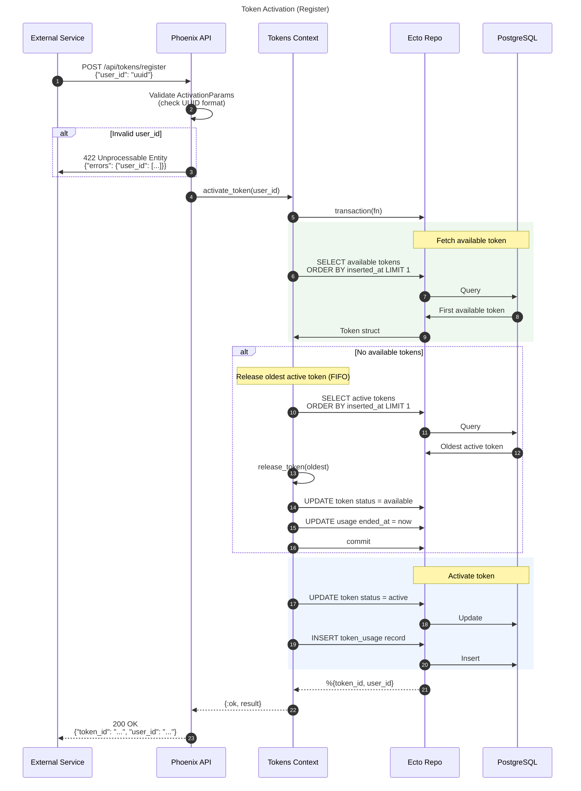
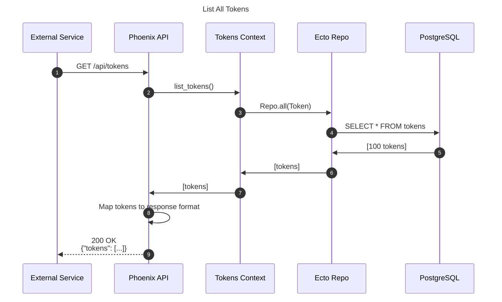
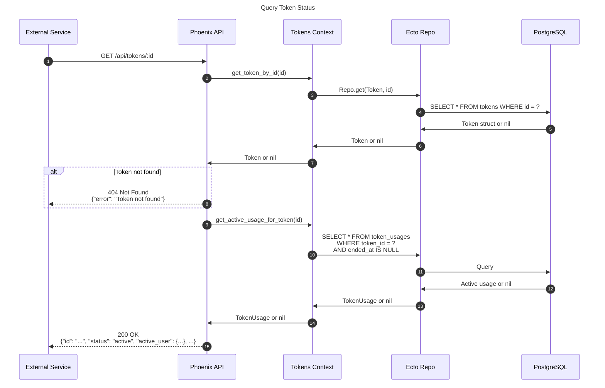
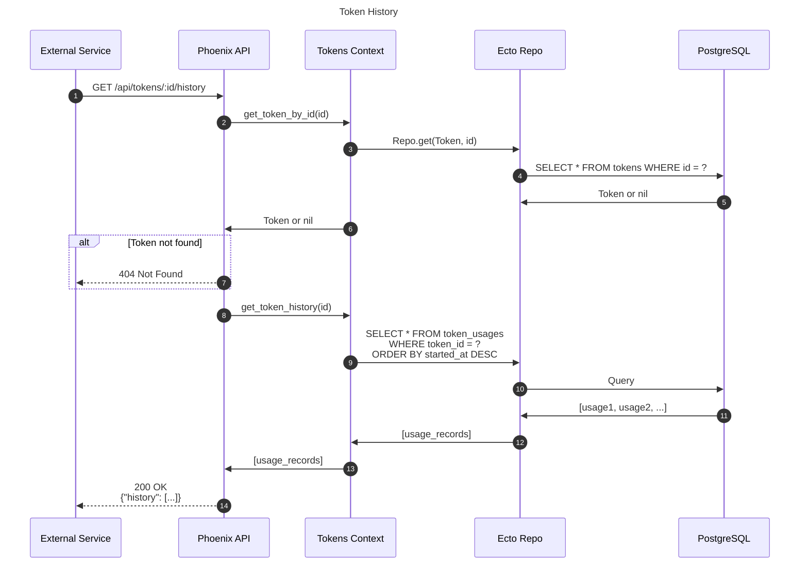
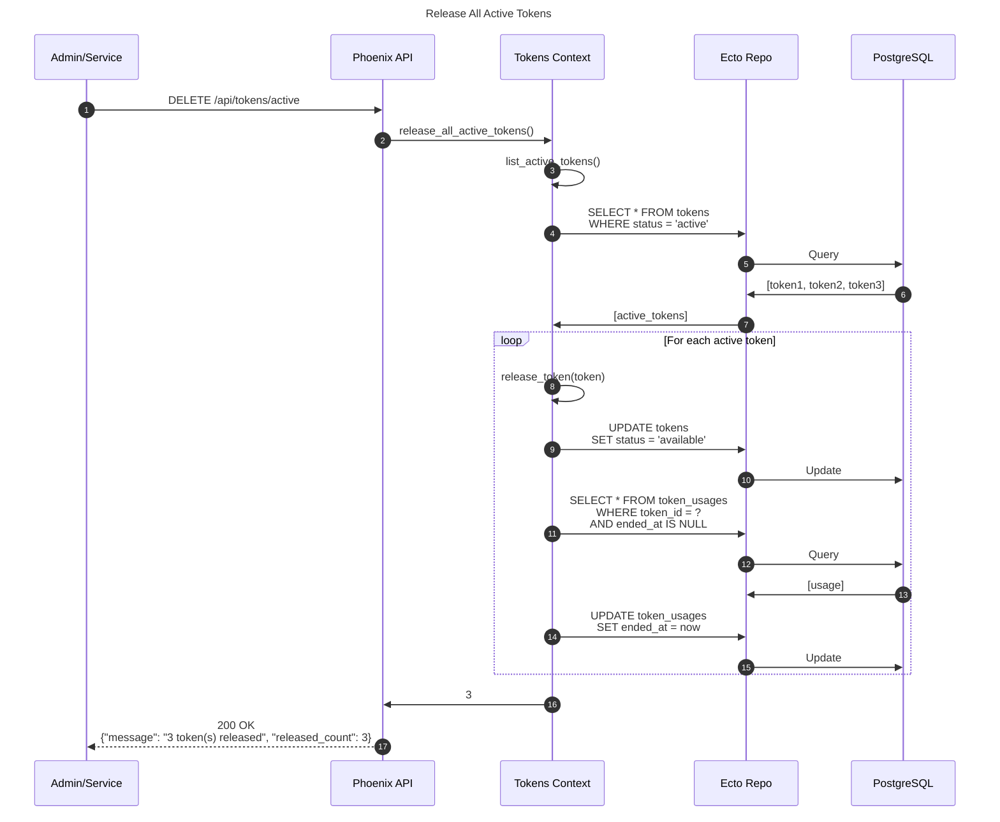
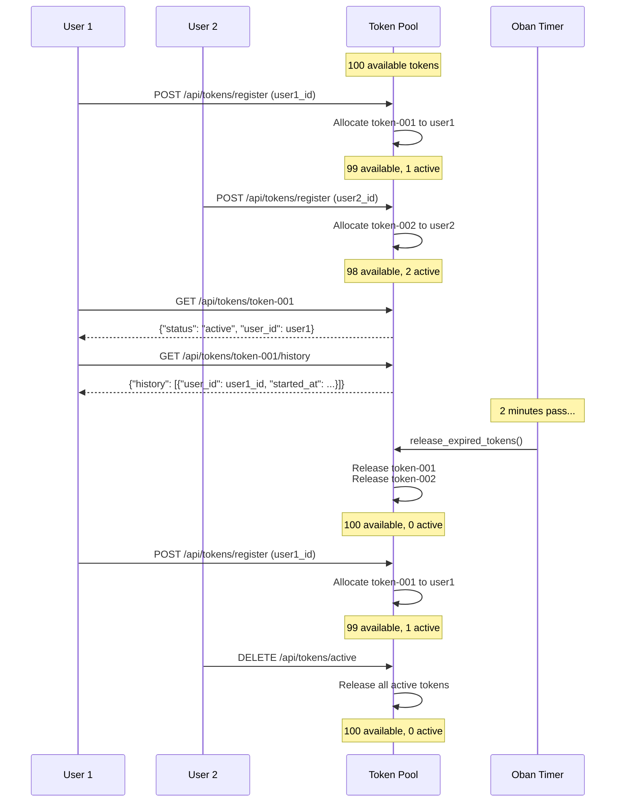

# TokenGuard

[](https://github.com/helderbarboza/token_guard/actions/workflows/ci.yml)

A lightweight token pool management system built with Elixir and Phoenix.

## Overview

TokenGuard is a **token pool management API** that manages a pool of pre-generated tokens that can be "activated" (checked out) by users. It's designed for scenarios where you need to:

- Manage shared resources like licenses, seats, or access passes
- Track who used which resource and when
- Automatically reclaim inactive resources
- Implement FIFO allocation policies

## Stack

- **Elixir** 1.15+ / **Erlang** OTP 26+
- **Phoenix** v1.8 (web framework)
- **Ecto** (database ORM)
- **PostgreSQL** 14+ (database)
- **Oban** (background job processing)
- **LiveDashboard** (monitoring)

## Features

- **Token Pool**: Pre-configured pool of 100 tokens (easily scalable)
- **FIFO Allocation**: Tokens are allocated in first-in-first-out order
- **Automatic Expiration**: Tokens automatically expire after 2 minutes from activation time
- **Usage History**: Full audit trail of token usage with start/end timestamps
- **Admin Controls**: Endpoints to release all active tokens instantly
- **Background Processing**: Oban-powered background job for token cleanup

## Getting Started

### Prerequisites

- Elixir 1.15+
- Erlang/OTP 26+
- PostgreSQL 14+

### Installation

1. **Install all dependencies and setup the project:**

```bash
mix setup
```

This will:
- Install Elixir dependencies (`mix deps.get`)
- Create the database
- Run migrations
- Seed 100 tokens
- Setup and build frontend assets

2. **Configure the database (if needed):**

Update `config/dev.exs` with your PostgreSQL credentials:

```elixir
config :token_guard, TokenGuard.Repo,
  username: "postgres",
  password: "postgres",
  hostname: "localhost",
  database: "token_guard_dev"
```

3. **Start the server:**

```bash
mix phx.server
```

Or run in interactive mode:

```bash
iex -S mix phx.server
```

4. **Visit the API at** [`http://localhost:4000`](http://localhost:4000)

### Development Tools

- **LiveDashboard**: [`http://localhost:4000/dev/dashboard`](http://localhost:4000/dev/dashboard)
- **Oban Dashboard**: [`http://localhost:4000/dev/oban`](http://localhost:4000/dev/oban)
- **HTTP Client**: Use [`api.http`](./api.http) with [REST Client](https://marketplace.visualstudio.com/items?itemName=humao.rest-client) for VS Code to test the API endpoints.

## API Reference

### Activate a Token (`POST /api/tokens/register`)

Register a user and receive an allocated token.



**Request:**

```http
POST /api/tokens/register
Content-Type: application/json

{
  "user_id": "a1b2c3d4-e5f6-7890-abcd-ef1234567890"
}
```

**Response:**

```json
{
  "token_id": "f47ac10b-58cc-4372-a567-0e02b2c3d479",
  "user_id": "a1b2c3d4-e5f6-7890-abcd-ef1234567890"
}
```

---

### List All Tokens (`GET /api/tokens`)

Get the status of all tokens in the pool.



**Request:**

```http
GET /api/tokens
```

**Response:**

```json
{
  "tokens": [
    {
      "id": "f47ac10b-58cc-4372-a567-0e02b2c3d479",
      "status": "available",
      "inserted_at": "2024-04-01T10:00:00Z",
      "updated_at": "2024-04-01T10:00:00Z"
    },
    {
      "id": "550e8400-e29b-41d4-a716-446655440000",
      "status": "active",
      "inserted_at": "2024-04-01T10:00:00Z",
      "updated_at": "2024-04-01T12:30:00Z"
    }
  ]
}
```

---

### Get Token Details (`GET /api/tokens/:id`)

Retrieve details for a specific token, including active user if any.



**Request:**

```http
GET /api/tokens/f47ac10b-58cc-4372-a567-0e02b2c3d479
```

**Response (available token):**

```json
{
  "id": "f47ac10b-58cc-4372-a567-0e02b2c3d479",
  "status": "available",
  "active_user": null,
  "inserted_at": "2024-04-01T10:00:00Z",
  "updated_at": "2024-04-01T10:00:00Z"
}
```

**Response (active token):**

```json
{
  "id": "f47ac10b-58cc-4372-a567-0e02b2c3d479",
  "status": "active",
  "active_user": {
    "user_id": "a1b2c3d4-e5f6-7890-abcd-ef1234567890",
    "started_at": "2024-04-01T12:30:00Z"
  },
  "inserted_at": "2024-04-01T10:00:00Z",
  "updated_at": "2024-04-01T12:30:00Z"
}
```

---

### Get Token History (`GET /api/tokens/:id/history`)

View the usage history for a specific token.



**Request:**

```http
GET /api/tokens/f47ac10b-58cc-4372-a567-0e02b2c3d479/history
```

**Response:**

```json
{
  "history": [
    {
      "user_id": "a1b2c3d4-e5f6-7890-abcd-ef1234567890",
      "started_at": "2024-04-01T14:00:00Z",
      "ended_at": "2024-04-01T14:02:00Z"
    },
    {
      "user_id": "b2c3d4e5-f6a7-8901-bcde-f12345678901",
      "started_at": "2024-04-01T12:30:00Z",
      "ended_at": "2024-04-01T12:32:00Z"
    }
  ]
}
```

---

### Release All Active Tokens (`DELETE /api/tokens/active`)

Immediately release all active tokens (admin operation).



**Request:**

```http
DELETE /api/tokens/active
```

**Response:**

```json
{
  "message": "3 token(s) released",
  "released_count": 3
}
```

**Response (no active tokens):**

```json
{
  "message": "0 token(s) released",
  "released_count": 0
}
```

## Configuration

### Token Lifetime

The token lifetime determines how long a token can be active before being automatically released. The default is 2 minutes.

To configure, set in `config/config.exs`:

```elixir
config :token_guard,
  token_lifetime: :timer.minutes(2)
```

Or in `config/dev.exs` / `config/prod.exs` for environment-specific values.

## Token Lifecycle



### Pool Size

The pool size is set during database seeding. To create a different number of tokens:

```elixir
# In iex
TokenGuard.Tokens.create_tokens(50)
```

## Testing

Run the test suite:

```bash
mix test
```

Run with coverage:

```bash
mix coveralls.detail
```

## Quality Checks

This project uses the `mix precommit` alias for quality checks:

```bash
mix precommit
```

This runs:
- Compilation with warnings as errors
- Dependency check
- Code formatting
- Credo linting
- Dialyzer type checking
- Test suite
